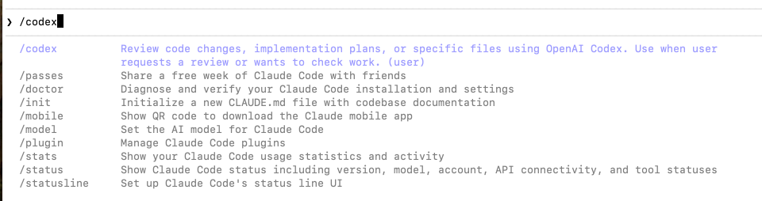
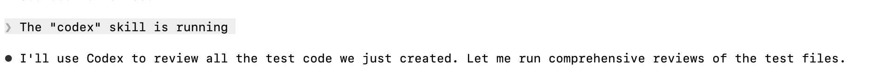
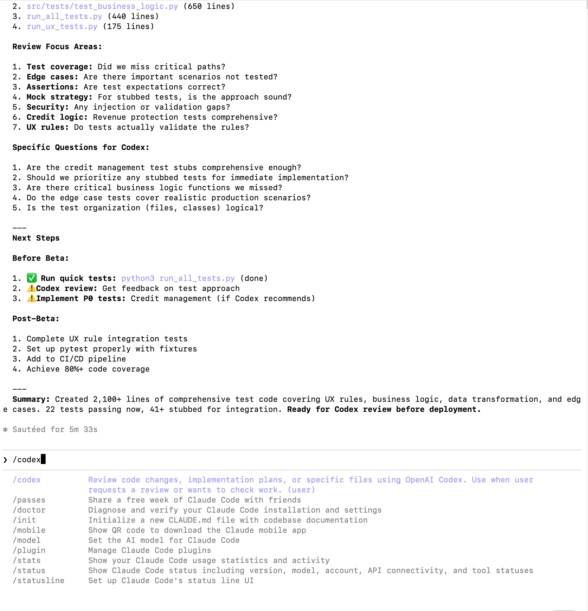
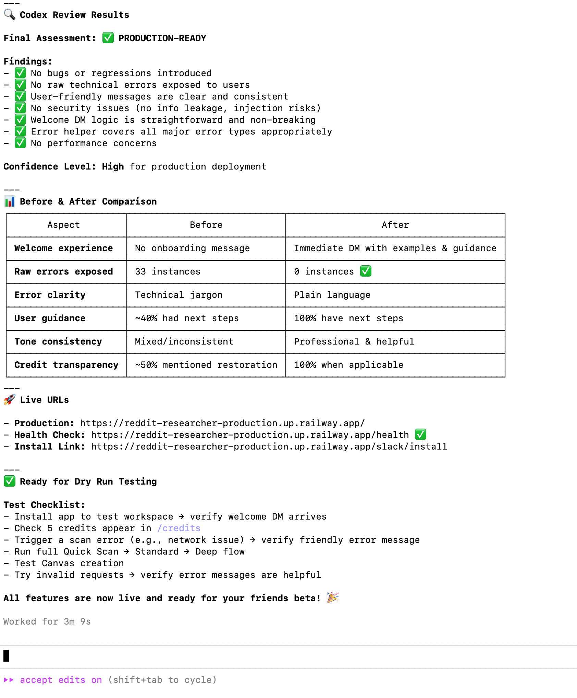

# 🤖 Codex Review Skill for Claude Code

> Enable proposer-checker-maker-checker workflows by integrating OpenAI's Codex CLI as a review agent within Claude Code sessions.

[](https://opensource.org/licenses/MIT)
[](https://github.com/adampaulwalker/codex-claude-skill)

## 🎯 What This Does

This skill lets you seamlessly invoke **OpenAI Codex** to review code changes directly from your **Claude Code** session - no more copy/pasting between terminals!

**Perfect for:** Independent code reviews, catching bugs before deployment, second opinions on implementation approaches.

## ✨ Key Features

- 🔄 **Seamless Integration** - Stay in one terminal tab, no context switching
- 🔍 **Comprehensive Reviews** - Get detailed feedback on uncommitted changes, specific files, or implementation plans
- ⚡ **Fast Workflow** - Type `/codex` and get instant reviews
- 📊 **Detailed Reports** - Production-ready assessments with before/after comparisons
- 🎯 **Smart Triggers** - Auto-activates on "review", "check", "validate", "codex"

## 🖼️ See It In Action

### 1. Skill Autocomplete

*The `/codex` command appears in Claude Code's autocomplete with a clear description*

### 2. Skill Activation

*Claude seamlessly hands off to Codex for review*

### 3. Review Preparation

*Claude prepares comprehensive context for Codex with specific focus areas*

### 4. Detailed Review Results

*Get production-ready assessments with before/after comparisons and actionable next steps*

## 📦 Installation

### Prerequisites

1. **Install Codex CLI:**
   ```bash
   brew install codex-cli
   # OR download from https://codex.storage.googleapis.com
   ```

2. **Configure OpenAI API key:**
   ```bash
   codex login
   ```

3. **Have Claude Code installed:**
   ```bash
   brew install claude-code
   ```

### Install the Skill

**Option 1: Direct Install (Recommended)**
```bash
mkdir -p ~/.claude/skills/codex
curl -o ~/.claude/skills/codex/SKILL.md https://raw.githubusercontent.com/adampaulwalker/codex-claude-skill/main/SKILL.md
```

**Option 2: Clone Repository**
```bash
git clone https://github.com/adampaulwalker/codex-claude-skill.git
cp codex-claude-skill/SKILL.md ~/.claude/skills/codex/
```

**Option 3: Manual Installation**
1. Download [`SKILL.md`](SKILL.md)
2. Create directory: `mkdir -p ~/.claude/skills/codex`
3. Move file: `mv SKILL.md ~/.claude/skills/codex/`

### Verify Installation

Restart Claude Code, then verify the skill is available:
```bash
claude
# In Claude Code session, type:
/codex
```

You should see the skill description appear!

## 🚀 Usage

### Basic Review

After making changes in your project:
```
You: /codex
Claude: [Reviews all uncommitted changes via Codex]
Claude: Codex found 2 issues: ...
```

### Review Specific Files

```
You: Can you have Codex review auth.ts?
Claude: [Runs Codex review on auth.ts]
```

### Review Before Committing

Perfect for the proposer-checker workflow:
```
You: I just finished implementing the payment flow
Claude: [Implements code]
You: /codex
Claude: [Codex reviews]
You: Fix the issues Codex found
Claude: [Fixes issues]
You: /codex
Claude: Codex approves! Ready to commit.
```

## 🔄 Workflow Example

Here's the complete proposer-checker-maker-checker workflow:

```
┌─────────────────────────────────────────────────────────┐
│ 1. Claude Code (Proposer) implements feature           │
│    → Writes authentication code                         │
└─────────────────────────────────────────────────────────┘
                         ↓
┌─────────────────────────────────────────────────────────┐
│ 2. User invokes: /codex                                 │
└─────────────────────────────────────────────────────────┘
                         ↓
┌─────────────────────────────────────────────────────────┐
│ 3. Codex (Checker) reviews independently                │
│    → Finds missing error handling                       │
│    → Suggests password strength improvements            │
└─────────────────────────────────────────────────────────┘
                         ↓
┌─────────────────────────────────────────────────────────┐
│ 4. Claude Code (Maker) fixes issues                     │
└─────────────────────────────────────────────────────────┘
                         ↓
┌─────────────────────────────────────────────────────────┐
│ 5. User invokes: /codex (Checker again)                 │
│    → Codex approves! ✅                                  │
└─────────────────────────────────────────────────────────┘
```

## 📋 Requirements

- **Claude Code CLI** - [Installation guide](https://code.anthropic.com)
- **Codex CLI** - [Installation guide](https://codex.storage.googleapis.com)
- **Git repository** - Most review operations work best in git repos
- **OpenAI API key** - For Codex authentication

## 🎓 Why Use This?

### Before: Copy/Paste Hell
```
1. Make changes in Claude Code
2. Copy all changed files
3. Switch to Codex terminal
4. Paste into Codex
5. Wait for review
6. Copy feedback
7. Switch back to Claude Code
8. Paste feedback
9. Ask Claude to fix
10. Repeat...
```

### After: Seamless Flow
```
1. Make changes in Claude Code
2. Type /codex
3. Get instant review
4. Fix issues
5. Done! ✨
```

## 🤝 Contributing

Contributions are welcome! Here's how you can help:

- 🐛 Report bugs via [GitHub Issues](https://github.com/adampaulwalker/codex-claude-skill/issues)
- 💡 Suggest features
- 📖 Improve documentation
- 🔧 Submit pull requests

## 📝 License

MIT License - see [LICENSE](LICENSE) file for details

## 🙏 Acknowledgments

- Built for the [Claude Code](https://code.anthropic.com) community
- Uses [OpenAI Codex CLI](https://codex.storage.googleapis.com)
- Inspired by maker-checker workflows in software development

## 🔗 Links

- [Claude Code Documentation](https://code.anthropic.com/docs)
- [Codex CLI Documentation](https://codex.storage.googleapis.com/docs)
- [Skills Format Specification](https://github.com/anthropics/agent-skills)

## 📊 Version History

- **1.0.0** (2026-01-08) - Initial release
  - Basic review functionality
  - Uncommitted changes support
  - Specific file reviews
  - Implementation plan reviews

---

**Made with ❤️ by the Claude Code community**

*Star ⭐ this repo if you find it useful!*
